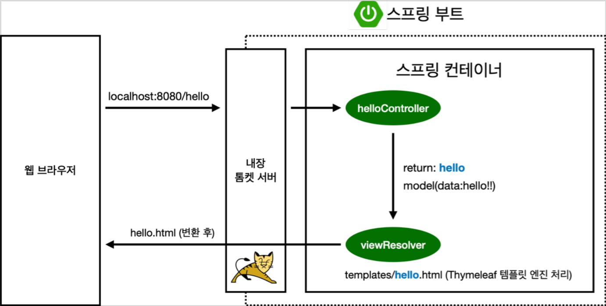
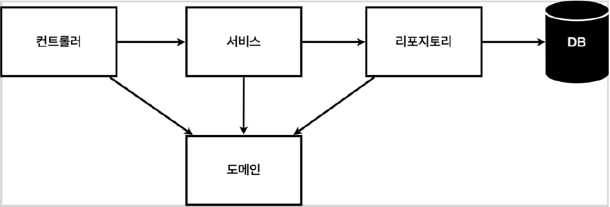
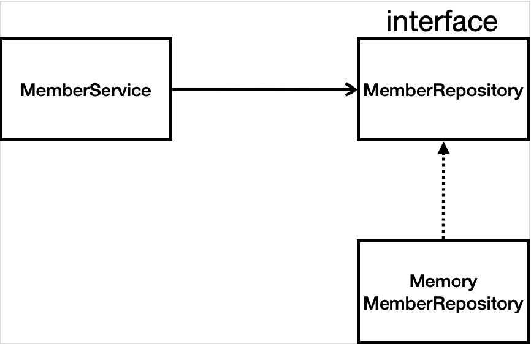

# Spring
자바 언어 기반의 프레임워크로 객체 지향 언어가 가진 강력한 특징을 쉽게 활용할 수 있게 도와주는 프레임워크입니다.

- **DI(Dependency Injection, 의존성 주입, 의존 관계)** 와 **DI 컨테이너**를 제공하여 **다형성과 OCP, DIP**를 가능하도록 지원합니다.
    - **클라이언트 코드의 변경 없이 기능을 확장**할 수 있으며, 마치 부품을 교체하듯이 개발할 수 있음을 의미합니다.
- 모든 설계에 인터페이스를 부여하는 것이 권장 되지만, 도입 시 **추상화**라는 비용이 발생하는 것을 인지해야 합니다.

### 객체지향의 핵심인 다형성을 극대화
- **역할과 구현으로 구분**하기 때문에 **유연하고 변경이 용이**합니다.
- **클라이언트에게 영향을 주지 않고 서버를 변경** 할 수 있습니다.
    - 클라이언트는 대상의 역할(인터페이스)만 알면 됩니다.
    - 클라이언트는 구현 대상의 내부 구조를 몰라도 됩니다.
    - 클라이언트는 구현 대상의 내부 구조가 변경되어도 영향을 받지 않습니다.
    - 클라이언트는 구현 대상 자체를 변경해도 영향을 받지 않습니다.
        - 역할 == 인터페이스
        - 구현 == 인터페이스를 구현한 클래스, 구현 객체
- **하지만, 다형성 만으로는 OCP, DIP를 지킬 수 없습니다.**

### Spring Boot - https://start.spring.io/
- [SOLID](#solid)
- [IoC, DI, 그리고 컨테이너](#ioc-di-그리고-컨테이너)
- [Maven vs Gradle](#maven-vs-gradle)
- [Spring Boot Library](#spring-boot-library)
- [Test Library](#test-library)
- [Embedded server](#embedded-server)
- [Business Requirement](#business-requirement)
- [Spring Bean](#spring-bean)
- [설정 형식 지원](#설정-형식-지원)
- [싱글톤](#싱글톤)
- [Dependencies](#dependencies)
- [컴포넌트 스캔](#컴포넌트-스캔)
- [Access to the Database](#access-to-the-database)
- [스프링 설정 이미지](#스프링-설정-이미지)
- [스프링 통합 테스트](#스프링-통합-테스트)
- [스프링 JdbcTemplate](#스프링-jdbctemplate)
- [JPA](#jpa)
- [AOP](#aop)


## SOLID
클린코드로 유명한 로버트 마틴이 정리한 객체 지향 설계의 5가지 권장 원칙
- SRP, Single Responsibility Principle : 단일 책임 원칙
    - 한 클래스는 하나의 책임만 가집니다.
        - 중요한 기준은 **변경**입니다. **변경**이 있을 때 파급 효과가 적으면 SRP를 잘 따른 것입니다.
- OCP, Open/Closed Principle : 개방/폐쇄 원칙
    - 소프트웨어 요소는 **확장에는 열려**있으나 **변경에는 닫혀** 있어야 합니다.
        - **다형성**을 활용합니다. ***인터페이스를  구현한 클래스를 만들어, 새로운 기능을 구현합니다.***
- LSP, Liskov Substitution Principle : 리스코프 치환 원칙
    - 인터페이스의 규약을 지켜서 구현해야 합니다. ***엑셀을 후진으로 구현하는 경우 LSP 위반.***
- ISP, Interface Segregation Principle : 인터페이스 분리 원칙
    - **특정 클라이언트를 위한 인터페이스 여러 개**가 범용 인터페이스 하나보다 좋습니다.
- DIP, Dependeny Inversion Principle : 의존관계 역전 원칙
    - **추상화(역할)에 의존하며, 구체화(구현)에 의존하지 않습니다.**
    - ***특정 배우에 맞게 연극을 준비했기 때문에, 배우가 바뀌면 연극이 불가능 하다는 것이 DIP 위반입니다.***

## IoC, DI, 그리고 컨테이너
- IoC, Inversion of Control, 제어의 역전
    - **클라이언트 구현 객체가 스스로** 서버 구현 객체를 생성/연결/실행 하여, 프로그램의 제어 흐름을 스스로 정의하는 것이 아니라 **외부에서 관리** 하는 것을 의미합니다.

- DI, Dependency Injection, 의존관계 주입
    - **정적인 클래스 의존 관계**와 실행 시점에 셜정되는 **동적인 객체(인스턴스) 의존 관계**를 분리해서 생각해야 합니다.
    - DI를 사용하면, 정적인 클래스 의존 관계를 변경하지 않고, 동적인 객체(인스턴스) 의존 관계를 쉽게 변경할 수 있습니다.
- IoC 컨테이너 == DI 컨테이너 == 스프링 컨테이너
    - 객체를 생성하고 관리하면서 의존 관계를 연결해 주는 것을 의미합니다.
    - `@Configuration`이 붙은 클래스를 사용하며, `@Bean`이라 적힌 메서드를 모두 호출하여 반환된 객체를 **스프링 컨테이너**에 등록합니다. 이렇게 등록된 객체를 **스프링 빈**이라 칭합니다.
        - `@Bean`만 사용해도 **스프링 빈으로 등록 되지만, 싱글톤을 보장하진 않습니다.** 스프링 설정 정보는 항상 `@Configuration`을 사용해야 합니다.
    - 스프링 빈은 `@Bean`이 붙은 메서드 명을 이름으로써 사용하는데, `@Bean = (name = "any")` 로 변경 가능합니다. 하지만, 관례상 특별한 일이 없다면, 그대로 사용합니다. ***단, Bean 이름이 중복 되면 충돌***
    - `applicationContext.getBean()`메서드를 사용하여 스프링 빈을 찾을 수 있습니다.
    - XML 혹은 애노테이션 기반의 자바 설정 클래스로 만들 수 있으며 애노테이션을 주로 사용하는 추세입니다.
    - `BeanFactory`를 직접 사용하는 경우는 거의 없으므로, 일반적으로 `ApplicationContext`를 스프링 컨테이너라고 칭합니다.
    - *정리하자면, 개발자가 직접 자바코드로 했던 것을 **스프링 컨테이너**에 스프링 빈으로 객체를 등록하고, **스프링 컨테이너**에서 해당 스프링 빈을 찾아서 사용하는 구조입니다.*


## Maven vs Gradle
### Maven - Ant의 불편 해소 + 부가기능 추가
- 빌드를 쉽게 수행.
- pom.xml을 이용한 정형화된 빌드 시스템을 제공.
### Gradle - Ant와 Maven의 장점 공유
- Maven을 사용할 수 있는 변환 가능 컨벤션 프레임 워크.
- 멀티 프로젝트에 적합.
- Groovy 문법 사용.

## Spring Boot Library
스프링을 편하게 사용할 수 있도록 하는 라이브러리로, 최근엔 기본으로 사용될 정도로 보편화되어있습니다. 별도의 웹 서버를 설치 안 해도 되며 외부 라이브러리 버전 또한 자동으로 맵핑해 줍니다.
- spring-boot-starter-web
    - spring-boot-starter-tomcat : 톰캣(WAS)
    - spring-webmvc : 스프링 웹 MVC
- spring-boot-starter-thymeleaf : 타임리프 템플릿 엔진(View)
- spring-boot-starter(공통) : 스프링 부트 + 스프링 코어 + 로깅
    - spring-boot
        - spring-core
    - spring-boot-starter-logging
        - logback, slf4j

## Test Library
- spring-boot-starter-test
    - junit : 테스트 프레임워크
    - mockito : 목 라이브러리
    - assertj : 테스트 코드를 좀 더 편하게 작성하게 도와주는 라이브러리
    - spring-test : 스프링 통합 테스트 지원


## Embedded server
Tomcat(WAS) : Apache Tomcat이라고도 불리는 오픈소스 Web Application Server입니다. 
<p align="center"></p>

## Business Requirement
- 데이터 : 회원ID, 이름
- 기능 : 회원 등록, 조회
- 아직 데이터 저장소가 선정되지 않은 상태
- **Web Application Architecture**
<p align="center"></p>

    1. 컨트롤러 : 웹 MVC의 Controller
    2. 서비스 : 핵심 비즈니스 로직 구현(e.g. 중복 가입 불가)
    3. 리포지토리 : DB 접근, 도메인 객체를 DB에 저장하고 관리
    4. 도메인 : 비즈니스 도메인 객체(e.g. 회원, 주문, 쿠폰 등 주로 DB에 저장하고 관리)

- **Class Dependency**
<p align="center"></p>

    1. DB가 선정되지 않았기 때문에 Interface로 구현 클래스를 변경할 수 있도록 설계
    2. DB는 RDB, NoSQL 등을 고려중인 상황.
    3. 초기 개발 단계에서는 구현체로 가벼운 메모리 기반의 DB 사용.

## Spring Bean
Spring IoC 컨테이너가 관리하는 자바 객체를 의미합니다. new로 생성하는 객체를 의미하는 것이 아닌 ApplicationContext.getBean()으로 얻어질 수 있는 객체를 의미합니다.
- 생성자에 `@Autowired`가 있으면 스프링이 연관된 객체를 스프링 컨테이너에서 찾아서 넣어줍니다. 이렇게 객체 의존관계를 외부에서 넣어주는 것을 DI(Dependency Injection), 의존성 주입이라 합니다.

### [빈 출력](https://github.com/lsw6684/Spring/tree/main/core/core/src/test/java/hello/core/beanfind/ApplicationContextInfoTest.java)
- 모든 빈
    - `ac.getBeanDefinitionNames()` : 스프링에 등록된 모든 빈 이름 조회
    - `ac.getBean` : 빈 이름으로 빈 객체(인스턴스) 조회
- 애플리케이션 빈
    - `getRole()`로 내부 빈 구분
        - `ROLE_APPLICATION` : 일반적으로 사용자가 정의한 빈
        - `ROLE INFRASTRUCTURE` : 스프링이 내부에서 사용하는 빈

### [빈 조회](https://github.com/lsw6684/Spring/tree/main/core/core/src/test/java/hello/core/beanfind/ApplicationContextBasicFindTest.java)
스프링 컨테이너에서 스프링 빈을 찾는 가장 기본적인 조회 방법입니다.
- `ac.getBean(빈이름, 타입)`
- `ac.getBean(타입)`
    - 조회 대상 스프링 빈이 없으면 예외 발생
        - `NoSuchBeanDefinitionException: No bean named 'xxx' available`
- [타입으로 조회 시, 동일 타입이 둘 이상인 경우](https://github.com/lsw6684/Spring/tree/main/core/core/src/test/java/hello/core/beanfind/ApplicationContextSameBeanFindTest.java)
    - `ac.getBeansOfType()`을 사용하면 오류 없이 조회할 수 있습니다.
- [상속 관계](https://github.com/lsw6684/Spring/tree/main/core/core/src/test/java/hello/core/beanfind/ApplicationContextExtendsFindTest.java)
    - 부모 타입으로 조회하면, 자식 타입도 함께 조회됩니다.
    - 모든 자바 객체의 최고 부모인 `Object`타입으로 조회 시, 모든 스프링 빈을 조회합니다.

### BeanFactory & ApplicationContect
- BeanFactory
    - 스프링 컨테이너의 최상위 인터페이스입니다.
    - 스프링 빈을 관리하고 조회하는 역할을 합니다.
    - `getBean()`을 제공합니다.
    

- ApplicationContext
    - BeanFactory 기능을 모두 상속받아서 제공합니다.
    - 빈 관리 기능 + 편리한 부가 기능을 제공합니다.
    - **ApplicationContext가 제공하는 부가 기능**
        1. 메시지소스를 활용한 국제화 기능
            - 클라이언트에 따라 나라별 언어를 지원합니다.  
        2. 환경 변수
            - 로컬, 개발, 운영 서버를 구분해서 처리합니다.
        3. 애플리케이션 이벤트
            - 이벤트를 발행하고 구독하는 모델을 편리하게 지원합니다.
        4. 편리한 리소스 조회
            - 파일, 클래스패스, 외부 등에서 리소스를 편리하게 조회합니다.


</br>

즉, BeanFactory를 직접 사용할 일은 거의 없으며 부가 기능이 포함된 ApplicationContext를 주로 사용합니다.


### 컴포넌트 스캔 원리
`@Component` 애노테이션이 있으면 스프링 빈으로 자동 등록됩니다.
`@Controller` 컨트롤러가 스프링 빈으로 자동 등록된 이유도 컴포넌트 스캔 때문입니다.
`@Component`를 포함하는 다음 애노테이션도 스프링 빈으로 자동 등록됩니다.
- `@Controller`
- `@Service`
- `@Repository`

## 설정 형식 지원
스프링 컨테이너는 다양한 형식의 설정 정보를 받아드릴 수 있게 설계되어 있습니다. ***(Java Code, XML, Groovy 등)***

### 애노테이션 기반 자바 코드 설정 사용
- `new AnnotationConfigApplicationContext(Application.class)`
- `AnnotationConfigApplicationContext` 클래스를 사용하면서 자바 코드로된 설정 정보를 넘기면 됩니다.

### XML 설정 사용
- 최근에는 스프링 부트 사용률이 올라감으로 인해 잘 사용하지 않지만, 아직 많은 레거시 프로젝트들이 XML로 되어 있습니다. XML을 사용하면 컴파일 없이 빈 설정 정보를 변경할 수 있는 장점이 있습니다.


### 스프링 빈 설정 메타 정보 - BeanDefinition
스프링이 다양한 설정 형식을 지원할 수 있는 이유는 `BeanDefinition`이라는 **추상화** 덕분입니다. 앞서 말해온, **역할과 구현을 개념적으로 나눈 것**이기 때문입니다.
- XML을 읽고 `BeanDefinition`을 생성
- 자바 코드를 읽어서 `BeanDefinition` 생성 <br />
즉, 스프링 컨테이너는 자바 코드인지, XML인지, 알 필요가 없으며, `BeanDefinition`만을 읽으면 됩니다.
    - `BeanDefinition`을 설정 메타정보라고 합니다.
    - `@Bean`, `<bean>` 당 각 하나의 메타 정보가 생성됩니다.
    - 스프링 컨테이너는 이 메타정보를 기반으로 스프링 빈을 생성합니다.

<br />

새로운 형식의 설정 정보가 추가 되면, `XxxBeanDefinitionReader`로 `BeanDefinition`을 생성하면 됩니다.


---

## 싱글톤
스프링은 기업용 온라인 서비스 기술 지원에 특화되어 있으며, 여러 Client의 요청이 동시에 발생하곤 합니다. Client 요청 마다, 객체 인스턴스를 생성하면 *극심한 메모리 낭비를 초래*하기 때문에, **인스턴스를 1개만 생성하여 공유**하는 [싱글톤 디자인 패턴](#싱글톤-패턴)을 지향해야 합니다.

### 싱글톤 패턴
클래스의 인스턴스가 1개만 생성되는 것을 보장합니다. 객체 인스턴스를 2개 이상 생성하지 못 하도록 해야 하며 이 것은 **private 생성자로, 외부의  new 키워드 사용을 막아야 합니다.**

### 싱글톤 패턴의 단점
- 구현하는 코드 자체의 양이 많습니다.
- 의존 관계상 클라이언트가 구체 클래스에 의존합니다. ***DIP(OCP) 위반 가능성***
- 테스트하기 어렵습니다.
- 내부 속성을 변경하거나 초기화하기 어렵습니다.
- private 생성자로 자식 클래스를 만들기 어렵습니다.
- 결론적으로 유연성이 떨어지며 안티패턴으로도 불리기도 합니다.
#### 스프링 컨테이너는 이러한 싱글톤 패턴의 문제점을 해결합니다.

### 싱글톤 컨테이너
**스프링 컨테이너**는 싱글톤 패턴의 [**문제점(단점)을 해결**](#싱글톤-패턴의-단점)하면서, 객체 인스턴스를 싱글톤으로 관리(자동)해줍니다. 즉, 싱글톤 컨테이너 역할을 합니다.
- **스프링 빈**또한 싱글톤으로 관리됩니다. 
- 이렇게 싱글톤 객체를 생성하고 관리하는 기능을 **싱글톤 레지스트리**라고 합니다.

### 싱글톤 패턴의 단점 해결
- 싱글톤 패턴 구현을 위해 지저분한 코드가 추가될 필요 없습니다.
- 유연성 저하를 방지합니다. 
    - DIP, OCP, 테스트, private 생성자로부터 자유롭게 사용할 수 있습니다.


### 싱글톤 방식의 주의점
여러 클라이언트가 하나의 객체 인스턴스를 공유하기 때문에, 싱글톤 객체는 **상태를 유지(stateful)하게 설계하면 안 됩니다.**
- **무상태(stateless) 설계 필요**
    - 특정 클라이언트에 의존적 필드가 있으면 안 됩니다.
    - 특정 클라이언트가 값을 변경할 수 있는 필드가 있으면 안 됩니다.
    - 가급적 **읽기만 가능**해야 합니다.
    - 필드 대신, 자바에서 공유되지 않는 **지역변수, 파라미터, ThreadLocal 등을** 사용해야 합니다.
- 스프링 빈의 필드에 공유 값을 설정하면, 큰 장애가 발생할 수 있습니다.

---

## Dependencies
- Spring web : Build web, including RESTful, applications using Spring MVC. Uses Apache Tomcat as the default embedded container.
- Thymeleaf : A modern server-side Java template engine for both web and standalone environments. Allows HTML to be correctly displayed in browsers and as static prototypes.

---

## 컴포넌트 스캔
 스프링 빈 등록 시, 자바 코드의 `@Bean`, 혹은 XML의 `<bean>`으로 직접 등록할 스프링 빈을 나열합니다. 하지만, 규모가 커질 수록 Human error로 누락할 가능성과 코드의 반복이 증가합니다. 이를 보완하기 위해, 스프링은 설정 정보 없이, 스프링 빈을 자동으로 등록하는 **컴포넌트 스캔**과, 의존 관계를 자동으로 주입하는 `@Autowired`를 제공합니다.
- `basePackages` : 탐색할 패키지의 시작 위치를 지정하여 하위 패키지를 모두 탐색합니다.
    - `basePackages = {"hello.core", "hello.service"}` : 여러 개의 시작 위치 지정 가능.
    - `basePackageClasses` : 지정한 클래스의 패키지를 탐색 시작 위치로 지정합니다. 만약 지정하지 않으면 `@ComponentScan`이 붙은 설정 정보 클래스의 패키지가 시작 위치로 지정됩니다.

### 권장 방법
패키지 위치를 지정하기보단, 설정 정보 클래스의 위치를 프로젝트 최상단으로 지정합니다. 최근, 스프링 부트도 해당 방법을 디폴트로 제공합니다. 참고로, 스프링 부트 사용 시, 스프링 부트이 대표적인 시작 정보 `@SpringBootApplication`를 해당 프로젝트 시작 루트 위치에 두는 것이 관례입니다. ***(해당 설정 안에는 `@ComponentScan`이 들어있습니다.)***

### 컴포넌트 스캔 기본 대상
컴포넌트 스캔은 `@Component`뿐만 아니라 하위 내용도 대상에 포함합니다.
- `@Component` : 컴포넌트 스캔에서 사용
- `@Controller` : 스프링 MVC 컨트롤러에서 사용
    - 스프링 MVC 커느롤러로 인식합니다.
- `@Service` : 스프링 비즈니스 로직에서 사용
    - 특별히 처리하는 작업은 없습니다. 개발자 입장에서 핵심 비즈니스 로직/계층을 인식할 수 있도록 합니다.
- `@Repository` : 스프링 데이터 접근 계층에서 사용
    - 스프링 데이터 접근 계층으로 인식하며, 데이터 계층의 예외를 스프링 예외로 변환합니다.
- `@Configuration` : 스프링 설정 정보에서 사용
    - 스프링 설정 정보로 인식하며, 스프링 빈이 싱글톤을 유지하도록 추가 처리를 합니다.


---

## Access to the Database
- H2 Database <br />
별도의 설치 과정 없이 사용하는 RDBMS로 JDBC API를 지원하며 표준 SQL을 사용합니다. 개발 단계의 테스트 DB로 이용되곤 합니다.
    - https://www.h2database.com
    - H2 console
- 순수 JDBC
    - build.gradle 파일에 jdbc, h2 DB 관련 라이브러리 추가
        ```
        implementation 'org.springframework.boot:spring-boot-starter-jdbc'
        runtimeOnly 'com.h2database:h2'
        ```

- 스프링 JDBC Template
- JPA
- Spring Data JPA

## 스프링 설정 이미지
<p align="center"></p>

- 개방-폐쇄 원칙(OCP, Open-Closed Principle)
    - 확장에는 열려있고 수정, 변경에는 닫혀있습니다.
- 스프링의 DI(Dependencies Injection)을 사용하면 **기존 코드를 전혀 손대지 않고 설정만으로 구현 클래스를 변경할 수 있습니다.**

## 스프링 통합 테스트
- @SpringBootTest : 스프링 컨테이너와 테스트를 함께 실행합니다.
- @Transactional : 테스트 케이스에 해당 애노테이션이 있다면, 테스트 시작 전에 트랜잭션을 시작하고, 테스트 완료 후에 **롤백**으로 DB를 복구하여 다음 테스트에 영향을 주지 않습니다.
- @Commit : 테스트 완료 후, 트랜잭션을 Commit합니다.

## 스프링 JdbcTemplate
- 순수 Jdbc와 동일한 환경설정을 하면 됩니다.
- 스프링 JdbcTemplate과 MyBatis같은 라이브러리는 JDBC API에서 본 반복 코드를 대부분 제거해 주지만, SQL은 직접 작성해야 합니다.

## JPA
- JPA는 기존의 반복 코드는 물론이고, 기본적인 SQL도 JPA가 직접 만들어서 실행합니다.
- JPA를 사용하면 SQL과 데이터 중심의 설계에서 객체 중심의 설계로 패러다임을 전환할 수 있습니다.
- JPA를 사용하면 개발 생산성을 크게 높일 수 있습니다.
- dependency
    ```java
    	implementation 'org.springframework.boot:spring-boot-starter-data-jpa'
    // JPA, JDBC 등을 포함    
    ```
1. Entity를 매핑합니다. - `@Entity`
2. PK를 매핑합니다.
3. IDENTITY를 설정하여 자동으로 ID가 매핑 되도록 합니다. - `@Id @GeneratedValue(strategy = GenerationType.IDENTITY)`
4. 서비스 계층에 트랜잭션을 적용합니다. - `@Transactional`
### 스프링 데이터 JPA
반복 개발해온 기본 CRUD기능을 포함하여 Repository에 구현 클래스 없이 인터페이스 만으로 개발이 가능합니다.

## AOP
Aspect Oriented Programming, 관점 지향 프로그래밍
### AOP가 필요한 상황
- 모든 메소드의 호출 시간을 측정할 때
- 공통 관심 사항(cross-cutting concern) vs 핵심 관심 사항(core concern)
- 회원 가입 시간, 회원 조회 시간 측정